# Go-Routines & Channels


### Synchronous(Sequential) Execution

* Executing items/elements one by one sequentially.

#### Exmaple Program for sequential execution

    ```go
        package main

        import (
            "log"
            "net/http"
        )

        func main() {
            sites := []string{
                "https://golang.org/",
                "http://openjdk.java.net/",
                "https://www.scala-lang.org/",
                "https://nodejs.org/en/",
                "https://www.python.org/",
                "https://aws.amazon.com/",
            }

            for _, site := range sites {
                checkStatus(site)
            }
        }

        func checkStatus(site string) {
            resp, err := http.Get(site)

            if resp.StatusCode != 200 || err != nil {
                log.Printf("%s is DOWN!!!! (%d)", site, resp.StatusCode)
                return
            }

            log.Printf("%s is UP!!!! (%d)", site, resp.StatusCode)
        }
    ```

###### Note : Above program will check web-site status sequentially.
* If we run the above program multiple times the output will be always in same order.

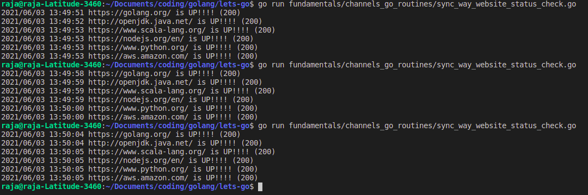

## Asynchronous (Concurrent) Execution

* Executing item/elemetns in asynchronous way (`Note : Concurrent != parallel`)

###### Notes on Go-Routines

* Sequential way of execution

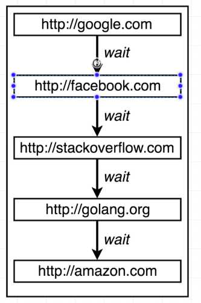


* Parallel Execution

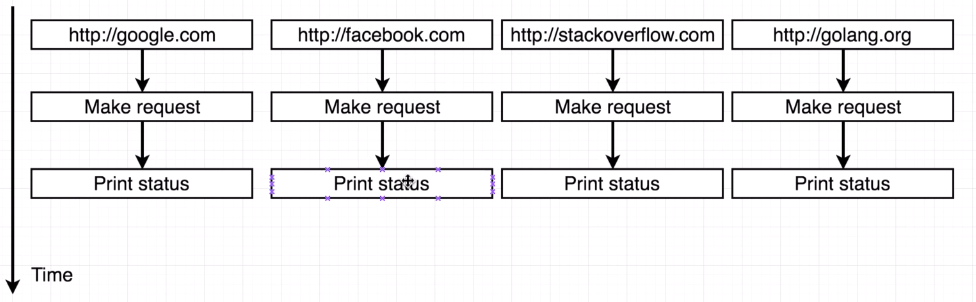

* `Main Go-Routine`

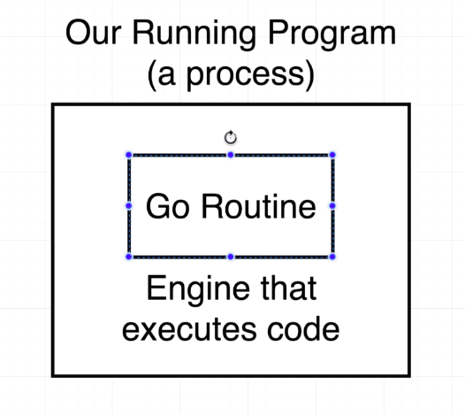

* Main Routine with Blocking Call

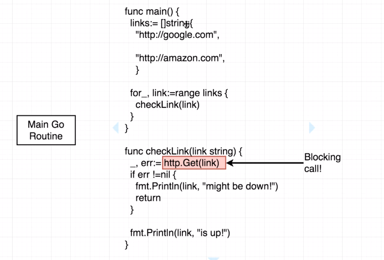

* Creating a new go-routine with `go` keyword

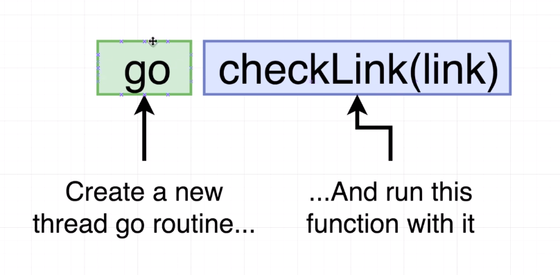

* Go Scheduler with one-core cpu

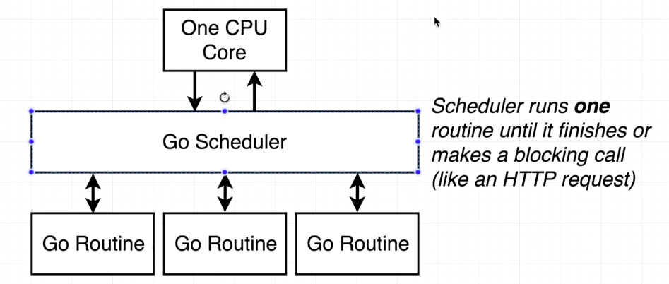

* Go Scheduler with multiple cpu cores

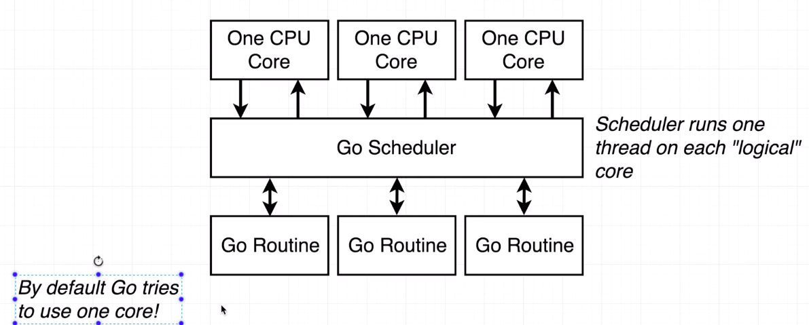

* Concurrency depiction

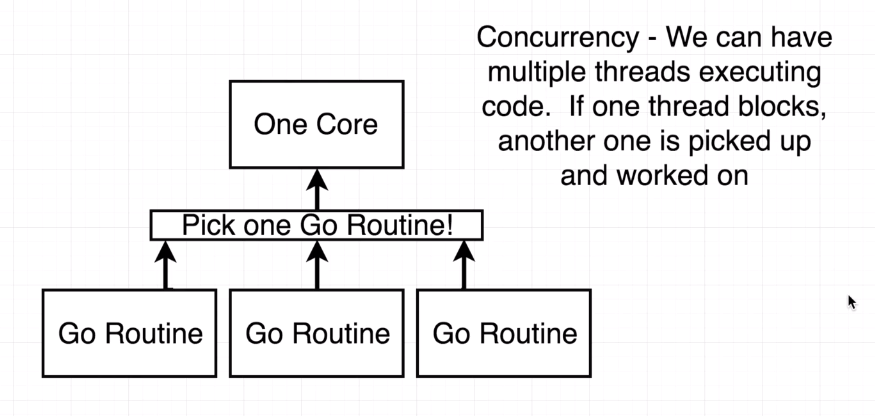

* Parllelism depiction


	    }
    ```

* When we execute the above program we are not getting any response like below.

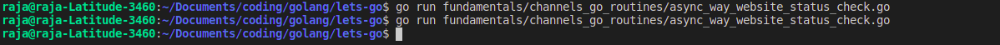

* Here actually, the `main` go routine is not waiting for it's child go routines to finish it's task. so before printing the output the main routine is exiting.

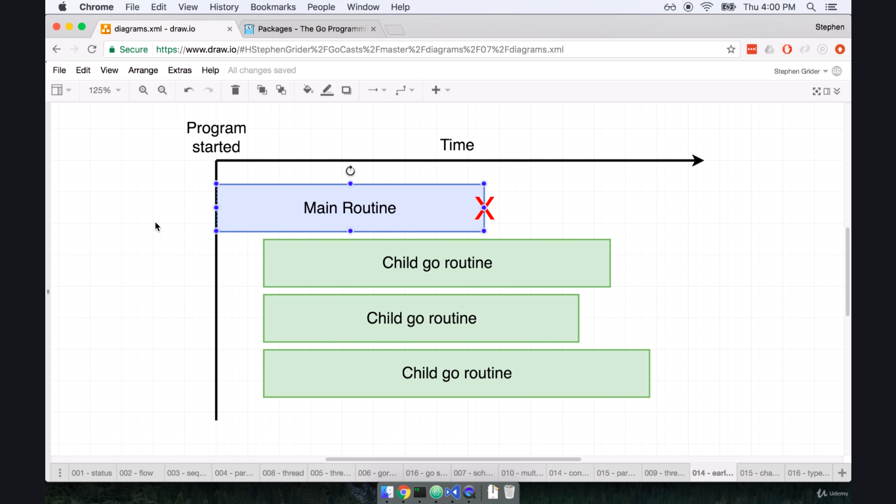

* To Make sure that, the `main` go routine should terminate only if all of child routine are finsihed. To communicate these between channels i.e. inter-goroutine communication we have `channel`

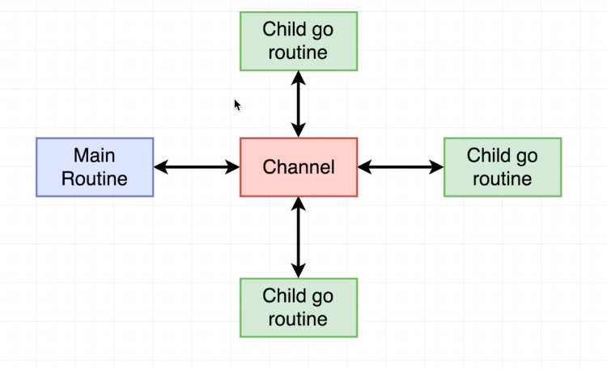

* `channel`s are typed i.e. every channel will accept value which satisfies it's type.

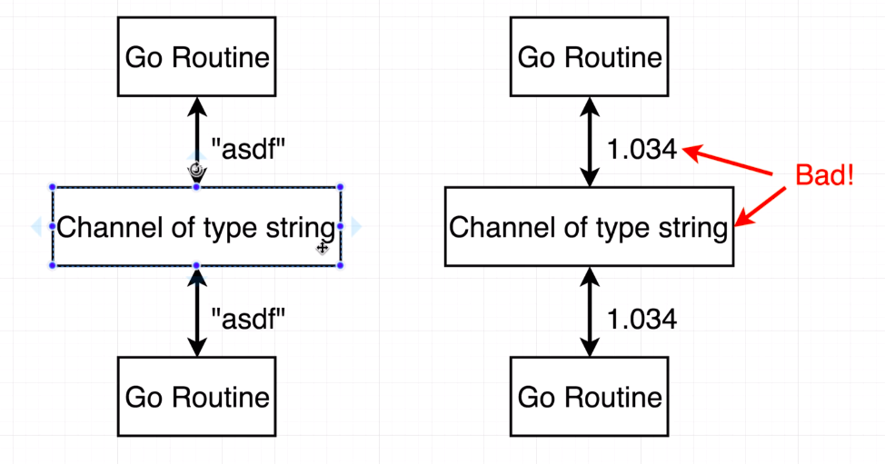

### Channel Operations

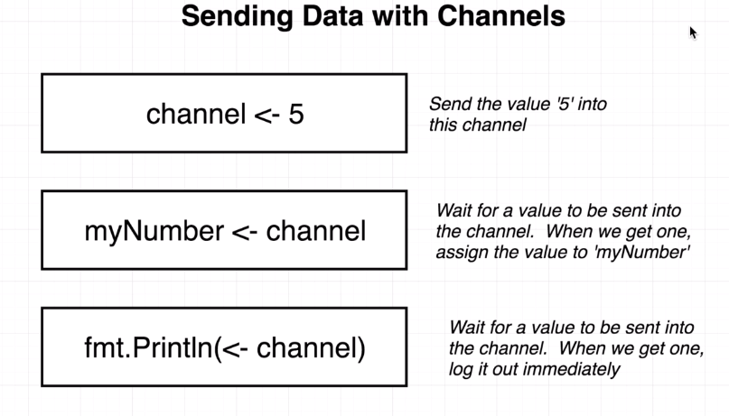

* Diagram to represent main and it's child routine communications.

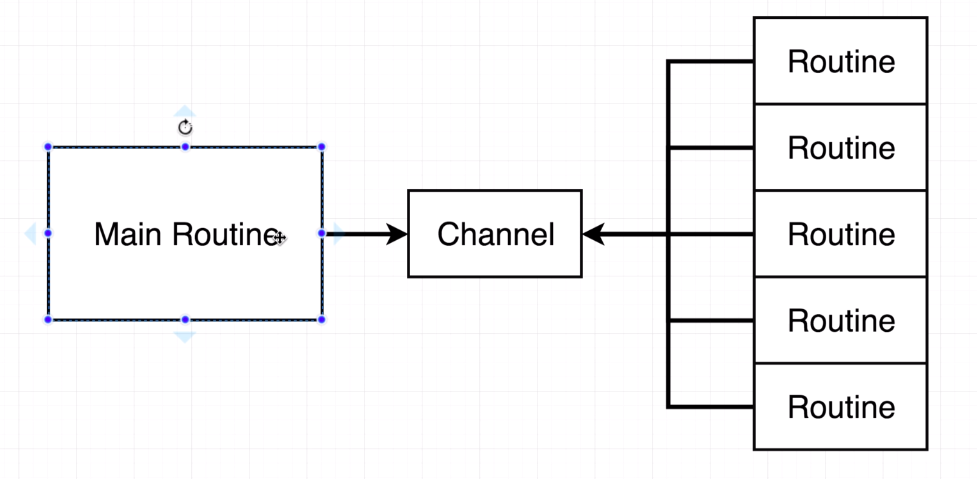

### Integrating `channel` to above code and `block channel` to get child go routines output

    ```go
    package main

    import (
        "fmt"
        "log"
        "net/http"
    )

    func main() {
        sites := []string{
            "https://golang.org/",
            "http://openjdk.java.net/",
            "https://www.scala-lang.org/",
            "https://nodejs.org/en/",
            "https://www.python.org/",
            "https://aws.amazon.com/",
        }

        var c chan string = make(chan string)

        for _, site := range sites {
            go checkStatus(site, c)
        }
        fmt.Printf("Response of Sites : %s \n", <-c)
    }

    func checkStatus(site string, c chan string) {
        resp, err := http.Get(site)

        if resp.StatusCode != 200 || err != nil {
            log.Printf("%s is DOWN!!!! (%d)", site, resp.StatusCode)
            c <- fmt.Sprintf("%s is DOWN!!!! (%d)", site, resp.StatusCode)
            return
        }

        log.Printf("%s is UP!!!! (%d)", site, resp.StatusCode)
        c <- fmt.Sprintf("%s is UP!!!! (%d)", site, resp.StatusCode)
    }
    ```

* Always program printing only one response (that might be faster response among all above sites)

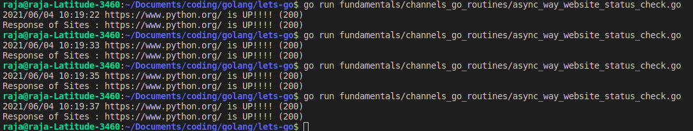

* The Behavior of above code will be like this.

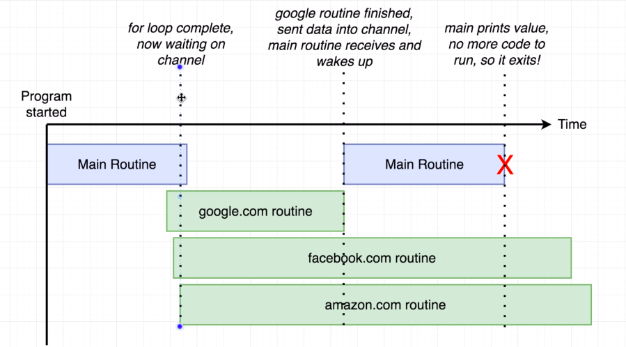)

* To make above works completley, make `main` routine should wait (seek) for the number of child routines messages for channel like below.

    ```go
        for index := range sites {
		    fmt.Printf("[%d] Response of Sites : %s \n", index, <-c)
	    }
    ```

    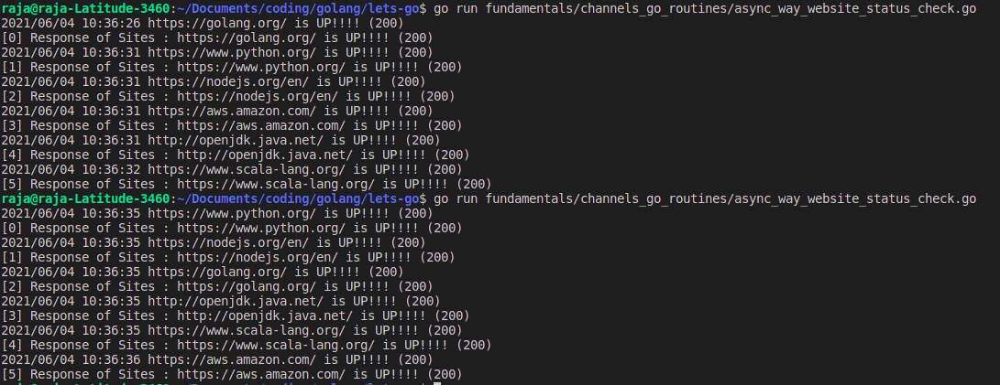

#### Repeating `Go-Routines`

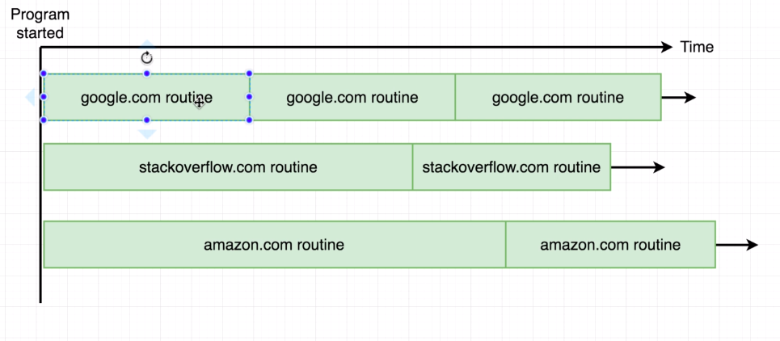

    ```go

        // package & imports

        func main() {
            // everything same as above program

            // Infinite loop
            for {
                go checkStatus(<-c, c)
            }
        }

        func checkStatus(site string, c chan string) {
            resp, err := http.Get(site)

            if resp.StatusCode != 200 || err != nil {
                log.Printf("%s is DOWN!!!! (%d)", site, resp.StatusCode)
                //c <- fmt.Sprintf("%s is DOWN!!!! (%d)", site, resp.StatusCode)
                c <- site // send site to channel
                return
            }

            log.Printf("%s is UP!!!! (%d)", site, resp.StatusCode)
            //c <- fmt.Sprintf("%s is UP!!!! (%d)", site, resp.StatusCode)
            c <- site // send site to channel
        }
    ```

* output will not end, it's keep on poll for website status

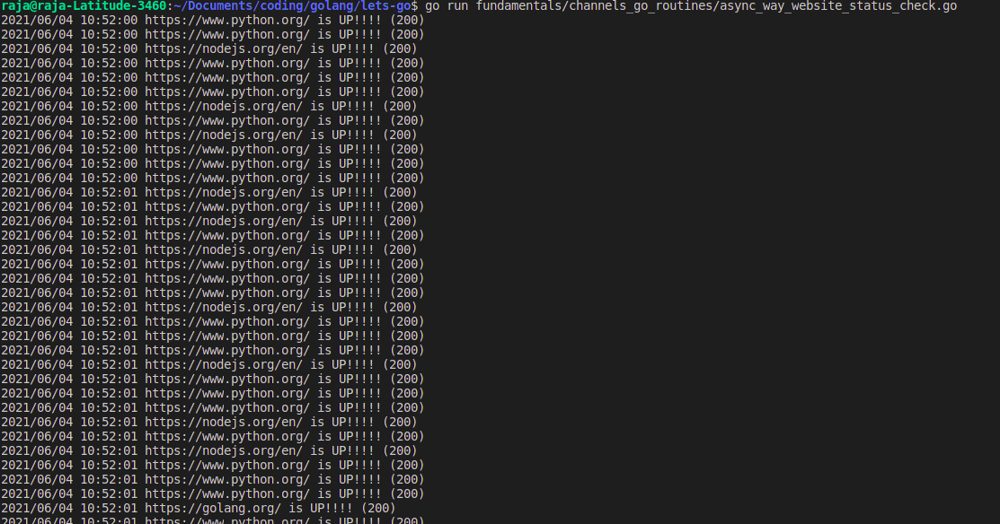

#### Alternative syntax for getting messages for channel indefinitley.

    ```go
        func main() {

        // .... same as above code

        /* for output := range c {
            fmt.Printf("Response of Sites : %s \n", output)
        } */

        for site := range c {
            go checkStatus(site, c)
        }
    }
    ```

* `time.Sleep(Duration)` : Sleep pauses the current goroutine for at least the duration d.
* Wait for certain time to make status check alternatevley.

    1. make `main` go routine to sleep, if you do so then we are block `main` routine so our entier program is blocked
    2. make `chile-go-routines` to sleep, if you do so immediatley our status check will not trigger
    3. make sleep between `main` & `child` go routines, so that we can start status check immediatley and wait for some time for every alternative status check for this make use of `functin literal`

    ```go
      for site := range c {
		time.Sleep(2 * time.Second) // main - go routine sleeps for 2 seconds
		go checkStatus(site, c)
	  }
    ```

    ```go
        func checkStatus(site string, c chan string) {
            time.Sleep(2 * time.Second) // child go routine will sleep for 2 seconds before sending message to channel
            resp, err := http.Get(site)
            // ... same as above code
        }
    ```

##### Function Literals (like java lambda)

    ```go
        // Syntax for go function literal

        func() {
            /// func body
        }()// function literal, () -> represents calling func literal
    ```

    ```go
        for site := range c {
            go func() {
                time.Sleep(2 * time.Second)
                go checkStatus(&site, site, c) // WARNING : loop variable site captured by func literal
            }()
        }
    ```

 * We are using same loop variable inside the func literal same both pointing to the same reference, so everytime whenever you call child go it will pass the same value and same value will send to the channel, so it's kind of looping same value over and over agin

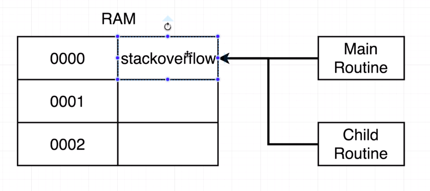

* Observe here `main` go routine site address, it's always same

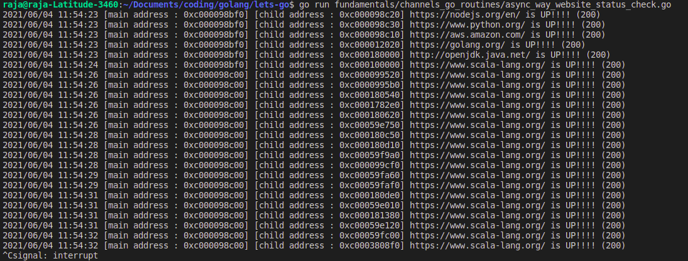

* To overcome the above issue, pass loop variable as a `function argument to the func literal` like below

    ```go
        for site := range c {
            go func(link string) {
                time.Sleep(2 * time.Second)
                go checkStatus(&link, link, c) // WARNING : loop variable site captured by func literal
            }(site)
        }
    ```

    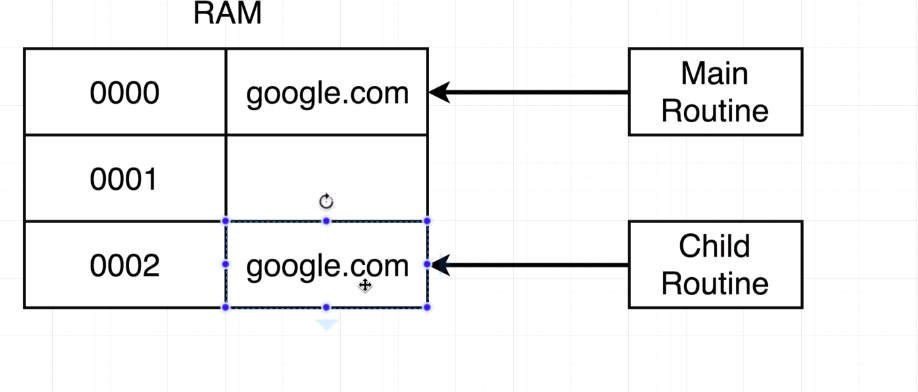

    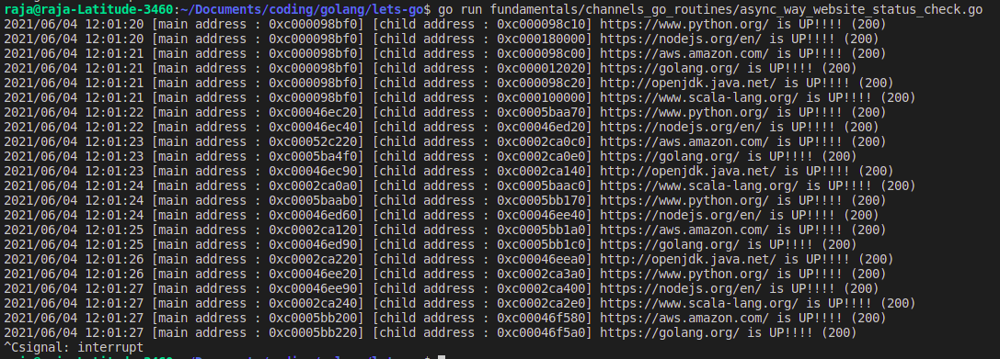

### Questions

1. Go Routines and Channels are tough, so let's start with the basics! Which of the following best describes what a go routine is?
    * Ans) `A separate line of code execution that can be used to handle blocking code`

2. What's the purpose of a channel?
    * Ans) `For communication between go routines`

3. Take a look at the following program.  Are there any issues with it?

    ```go
        package main

        import (
        "fmt"
        )

        func main() {
        greeting := "Hi There!"

        go (func() {
            fmt.Println(greeting)
        })()
        }
    ```
    * Ans)
        1. The `greeting` variable is referenced from directly in the go routine, which might lead to issues if we eventually start to change the value of `greeting`
        2. The program will likely exit before the `fmt.Println` function has an opportunity to actually print anything out to the terminal; this might not be the intent of the program.

4. Is there any issue with the following code?

    ```go
        package main
 
        func main() {
            c := make(chan string)
            c <- []byte("Hi there!")
        }
    ```
    * `The channel is expecting values of type string, but we are passing in a value of type byte slice, which is not technically a string`

5. Is there any issue with the following code?

    ```go
        package main
 
        func main() {
            c := make(chan string)
            c <- "Hi there!"
        }
    ```
    * Ans) `The syntax of this program is OK, but the program will never exit because it will wait for something to receive the value we're passing into the channel` will get error `fatal error: all goroutines are asleep - deadlock!`

6. Ignoring whether or not the program will exit correctly, are the following two code snippets equivalent?

* Snippet #1
    ```go
        package main

        import "fmt"

        func main() {
            c := make(chan string)
            for i := 0; i < 4; i++ {
                go printString("Hello there!", c)
            }

            for s := range c {
                fmt.Println(s)
            }
        }

        func printString(s string, c chan string) {
            fmt.Println(s)
            c <- "Done printing."
        }

        /* 
            OUTPUT:
            =======
            Hello there!
            Done printing.
            Hello there!
            Done printing.
            Hello there!
            Done printing.
            Hello there!
            Done printing.
            fatal error: all goroutines are asleep - deadlock!
       */
    ```

* Snippet #2

    ```go
        package main

        import "fmt"

        func main() {
            c := make(chan string)

            for i := 0; i < 4; i++ {
                go printString("Hello there!", c)
            }

            for {
                fmt.Println(<- c)
            }
        }

        func printString(s string, c chan string) {
            fmt.Println(s)
            c <- "Done printing."
        }

        /*
            OUTPUT:
            =======
            Hello there!
            Done printing.
            Hello there!
            Done printing.
            Hello there!
            Done printing.
            Hello there!
            Done printing.
            fatal error: all goroutines are asleep - deadlock!
        */
    ```

    * Ans) `They are same`