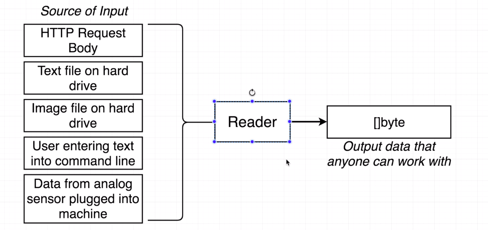

# Interfaces

* We Know that
  * Every `value` has a `type`
  * Every `function` has to specify the `type of its arguments`
* `so does that mean` Every function we ever write has to be re-written to accommodate different types even if the logic in it is identical ?

* Let's think about `shuffle()` from cards project
  * `func (d deck) shuffle()` -> Can only shuffle a value of type `deck`
  * `func (s []float64) shuffle()` -> Can only suffle a value of type `[]float64`
  * `func (s []string) shuffle()` -> Can only shuffle a value of type `[]string`
  * `func (s []int suffle()` -> Can only shuffle a value of type `[]int`


* Let's have a look at example

    ```go
        package main

        import (
            "fmt"
            "log"
        )

        type englishBot struct{}

        type spanishBot struct{}

        func main() {
            eb := englishBot{}
            printEnglishGreeting(eb)

            sb := spanishBot{}

            printSpanishGreeting(sb)
        }

        // Note: If we don't use reference of receiver, then no need to mention the reference variable
        func (englishBot) getGreeting() string {
            return fmt.Sprintf("Hi, %s !", "Raja")
        }

        func (spanishBot) getGreeting() string {
            return fmt.Sprintf("Hola, %s !", "Raja")
        }

        func printEnglishGreeting(eb englishBot) {
            log.Println(eb.getGreeting())
        }

        func printSpanishGreeting(sb spanishBot) {
            log.Println(sb.getGreeting())
        }
    ```
## Note : Go Doesn't support method overloading

* From the above example we noticed that
  * `getGreeting` - Very different logic in these functions!
  * but whereas `print*Greeting()` have identical logic!

* The above code can be refactored like below with the help `interface`

    ```go
        package main

        import (
            "fmt"
            "log"
        )

        type bot interface {
            getGreeting() string
        }

        type englishBot struct{}

        type spanishBot struct{}

        func main() {
            eb := englishBot{}
            sb := spanishBot{}

            printGreeting(eb)
            printGreeting(sb)
        }

        func (englishBot) getGreeting() string {
            return fmt.Sprintf("Hi, %s !", "Raja")
        }

        func (spanishBot) getGreeting() string {
            return fmt.Sprintf("Hola, %s !", "Raja")
        }

        func printGreeting(b bot) {
            log.Println(b.getGreeting())
        }
    ```
* The explanation of the above code will be like


### Types
* `Concrete Type` : Can get value by creating these `types`
  1. map
  2. struct
  3. int
  4. string
  5. englishBot
* `Interface Type`: Can't get value / can't create them
    1. bot (in our above example)

#### Notes about interface


### net/http.Response Interface

    ```go
        package main

        import (
            "log"
            "net/http"
        )

        func main() {
            resp, err := http.Get("http://ip.jsontest.com/")

            if err != nil {
                log.Printf("something went wrong while calling : %v \n", err)
            }

            log.Printf("Got Response : %v \n", resp)

            bs := make([]byte, 9999)
            resp.Body.Read(bs)
            fmt.Printf("The Response Body : %s \n", string(bs))
        }
    ```

#### Response.Body Representation


* Response Interface : https://golang.org/pkg/net/http/#Request

#### Reader Interface

* `Reader Interface` : https://golang.org/pkg/io/#Reader





#### Writer Interface
* `Writer Interface` : https://golang.org/pkg/io/#Writer


#### io.Copy(writer, reader)
* `Copy Method` : https://golang.org/pkg/io/#Copy


#### Questions
1. When we say that interfaces can be satisfied implicitly, we mean that..
    * Ans) `We don't have to write any extra code to say that some type satisfies an interface`
2. To say that a type satisfies an interface means that...
    * Ans) `The type implements all of the functions contains in the interface definition`

3. In the following code, does the square type satisfy the shape interface?

    ```go
        type shape interface {
           area() int
        }

        type square struct {
            sideLength int
        }

        func (s square) area() int {
            return s.sideLength * s.sideLength
        }

        func printArea(s shape) {
            fmt.Println(s.area())
        }
    ```
    * Ans) `Yes, because "square" defines the "area" function that returns an "int"`

4. Take a look at the following code.  Does the rectangle type satisfy the shape  interface?

    ```go
        type shape interface {
           area() int
        }

        type square struct {
            sideLength int
        }

        type rectangle struct {
            height float64
            width float64
        }

        func (s square) area() int {
            return s.sideLength * s.sideLength
        }

        func (r rectangle) area() float64 {
            return r.height * r.width
        }

        func printArea(s shape) {
            fmt.Println(s.area())
        }
    ```
    * Ans) `No, because "rectangle's" version of the "area" function returns a "float64", but the "shape" interface expects a return type of "int"`

5. Take a look at the following code.  Type square appears to successfully implement the shape interface, but the implementation of square 's area function looks broken - it always returns a value of 10 no matter what the side length of the square is.  Will the shape  interface do anything to help us catch this error?

    ```go
        type shape interface {
            area() int
        }

        type square struct {
            sideLength int
        }

        func (s square) area() int {
            return 10
        }

        func printArea(s shape) {
            fmt.Println(s.area())
        }
    ```
    * Ans) `No, interface are only used to help with types. We can still easily write code that does something completely wrong.`

6. Types that implement the Reader interface are generally used to...
    * Ans) `Read information from an outside data source into our application`

7. Imagine that you ask a coworker to create a new type that implements the Reader  interface to take data from a text file and print it on the screen.  They present you with the following code:

    ```go
        type textFileReader struct {}

        func (textFileReader) Read(bs []byte) (int, error) {
            return "Information from a text file"
        }
    ```
They say that this code successfully compiled, so it must be correct. You then review their code and give them feedback.  What would you say?

   * Ans) `I would say that while the "textFileReader" type conforms to the requirements of the "Reader" interface, it doesn't actually implement the desired behavior of reading a file from the hard drive.`

8. Because interfaces are satisfied implicitly, it can be tough to figure out which types satisfy which interfaces.
   Take a look at the type File inside the os package here: `https://golang.org/pkg/os/#File`
    Does the `File` type satisfy both the `Reader` and `Writer` interfaces?

    * Ans) `Yes`, because it's implementing `Reader` & `Writer` interface methods.
            ```go
                    func (f *File) Read(b []byte) (n int, err error)
                    func (f *File) Write(b []byte) (n int, err error)
            ```