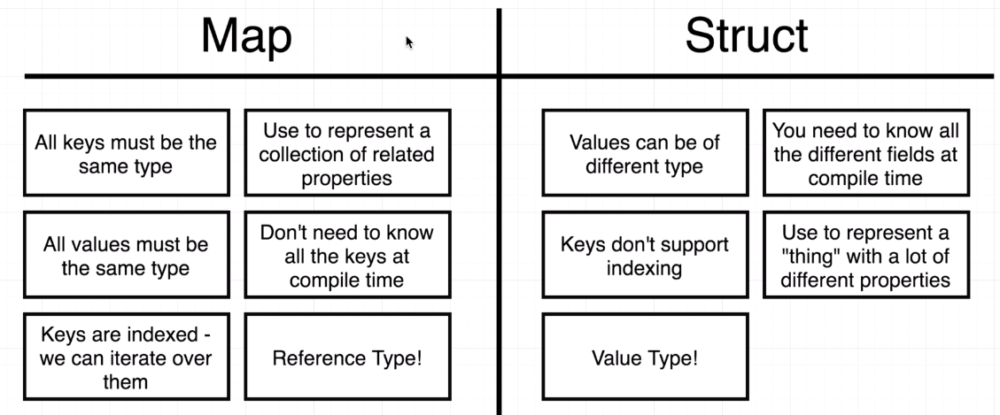

# MAP

* `map` is a collection of key-value pair
  * all `keys` must be of same type
  * all `values` must be of same type

    ```go
        countries := map[string]string {
            "IN": "India",
            "SG" : "Singapore",
            "AUS" : "Australia"
        }
    ```
    * Here map[string]string -> defining map with key data type and value data type
                ||      ||
                \/      \/
            Key_TYPE VALUE_TYPE

## Map vs Struct

)

### Questions
1. Can some of the keys in a single map be of type int  and others of type string ?
    * Ans) `No`

2. Can some of the values in a single map be of type int  and others of type string ?
    * Ans) `No`

3. Take a look at the following code.  What would the print statement log out?

    ```go
        package main
        import "fmt"

        func main() {
            m := map[string]string{
                "dog": "bark",
            }
            changeMap(m)
            fmt.Println(m)
        }

        func changeMap(m map[string]string) {
            m["cat"] = "purr"
        }
    ```
    * Ans) `map[dog: bark cat:purr]` (`Thanks to reference Types`)

4. What would happen if we tried to run the following program?  Look closely at all the code in it :)

    ```go
        package main
        import "fmt"

        func main() {
            m := map[string]string{
                "dog": "bark",
                "cat": "purr",
            }
            for key, value := range m {
                fmt.Println(value)
            }
        }
    ```
    * Ans) `The Compiler would throw an error because the variable "key" was created but never used.`