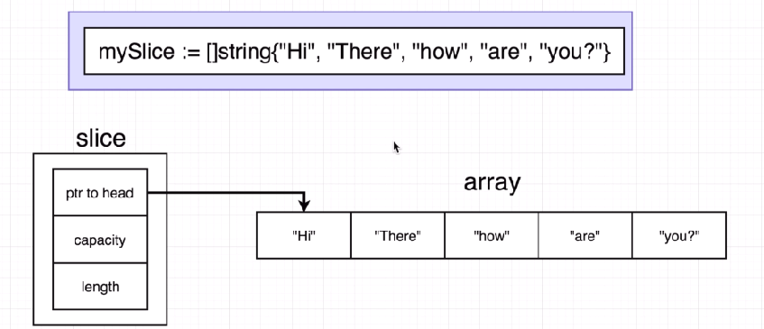
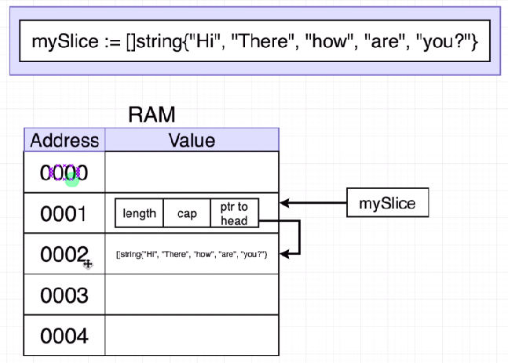
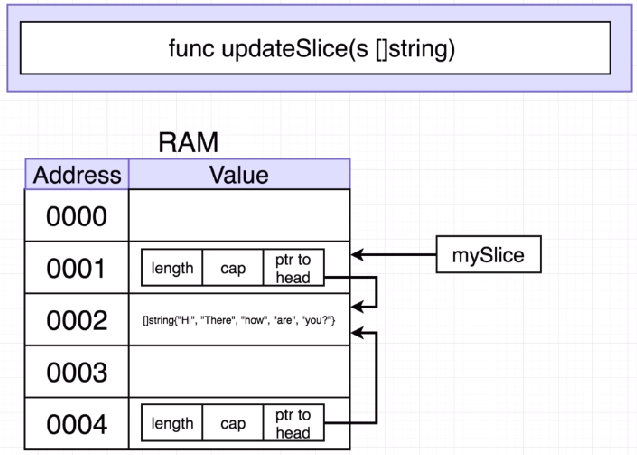
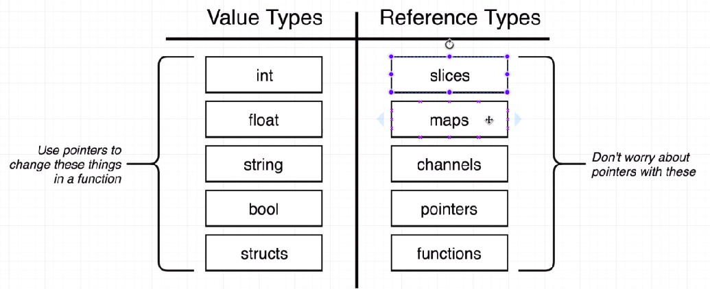

# Struct
* `struct` is a data structure i.e. a collection of properties that are related together.


### Questions on Pointers
1. Whenever you pass an integer, float, string, or struct into a function, what does Go do with that argument?
   * Ans) It creates a `copy of each argument`, and these copies are used inside of the function
2. What will the following program print out?
    ```go
        package main
        import "fmt"

        func main() {
            name := "Bill"

            fmt.Println(&name)
        }
    ```
    * Ans) `The memory address` that "Bill" is stored at

3. What is the `&` operator used for?
    * Ans) Turning a `pointer into a value`

4. When you see a `*` operator in front of a pointer, what will `it turn the pointer into`?
   * Ans) `A Value`

5. When the following program runs, the fmt.Println call reports that the latitude field of newYork is still equal to 40.73 .  What changes should we make to get the latitude of newYork to update to 41.0 ?
    ```go
        package main

        import "fmt"

        type location struct {
            longitude float64
            latitude float64
        }

        func main() {
            newYork := location {
                latitude: 40.73,
                longitude: -73.93,
            }

            newYork.changeLatitude()

            fmt.Println(newYork)
        }

        func (lo location) changeLatitude() {
            lo.latitude = 41.0
        }

        // Solution (Updated function)
        func (lo *location) changeLatitude() {
            (*lo).latitude = 41.0
        }
    ```

    * Ans) Change the receiver type of `changeLatitude` to `*location`, then replace `lo` with `(*lo)` in the function body. This will turn the pointer `lo` into a value type and then update it.

6. Take a look at the following snippet of code.

    ```go
        package main

        import "fmt"

        type location struct {
            longitude float64
            latitude float64
        }

        func main() {
            newYork := location{
                latitude: 40.73,
                longitude: -73.93,
            }

            newYork.changeLatitude()

            fmt.Println(newYork)
        }

        func (lo *location) changeLatitude() {
            (*lo).latitude = 41.0
        }
    ```
    In the 'changeLatitude' function, what is `*location` in the receiver list (after the word 'func') communicating to us?
    * Ans) It `specifies the type of the receiver that the function expects`

7. Take a look at the following program.  What will the Println  function in the main  function print out?

    ```go
        package main

        import "fmt"

        func main() {
            name := "Bill"
            updateValue(name)
            fmt.Println(name)
        }

        func updateValue(n string) {
            n = "Alex"
        }
    ```
    * Ans) `Bill`

8. Take a look at the following program.  The changeLatitude function expects a receiver of type pointer to a location struct , but in the main function the receiver is a value type of a struct.  What will happen when this code is executed?

    ```go
        package main

        import "fmt"

        type location struct {
            longitude float64
            latitude float64
        }

        func main() {
            newYork := location{
                latitude: 40.73,
                longitude: -73.93,
            }

            newYork.changeLatitude()

            fmt.Println(newYork)
        }

        func (lo *location) changeLatitude() {
            (*lo).latitude = 41.0
        }
    ```
    * Ans)  This program uses a shortcut, where Go will automatically assume that even though `newYork.changeLatitude()` is using a value type we probably meant to pass in a pointer to the `newYork` struct

9. Here's a tricky one!  What will the following program print out?

    ```go
        package main

        import "fmt"

        func main() {
            name := "Bill"

            fmt.Println(*&name)
        }

    ```
    * Ans) `Bill`

## GOTCHA

    ```go
        package main

        import "fmt"

        func main() {
            greet := []string{"Hi", "How", "are", "you?"}

            fmt.Println(greet) // [Hi How are you?]

            updateSlice(greet)

            fmt.Println(greet) // [Bye How are you?]  -> updated slice without using pointers
        }

        func updateSlice(greet []string) {
            greet[0] = "Bye"
        }
    ```
* `Arrays` -> Primitive data structure, Can't be resized. Rarely used directly
* `Slices` -> Can grow and shrink, Used 99% of the time for lists of elements

* Slice will point to array internally for data


* The Memory representation of array and slice


* If we pass slice to another function it will pass by value but copied slice will also point's original data


* Value Types vs Reference Types


## Questions on Value Types & Reference Types

1. When we create a slice, Go will automatically create which two data structures?
    * Ans) `An array and a structure that records the length of the slice, the capacity of the slice, and a reference to the underlying array.`

2. In the following code snippet, when we pass mySlice to the updateSlice function, is the mySlice value being copied before being passed into the function?

    ```go
        package main

        import "fmt"

        func main() {
            mySlice := []string{"Hi", "There", "how", "are", "you?"}

            updateSlice(mySlice)

            fmt.Println(mySlice)
        }

        func updateSlice(s []string) {
            s[0] = "Bye"
        }
    ```
    * Ans) `Yes`

3. With 'value types' in Go, do we have to worry about pointers if we want to pass a value to a function and modify the original value inside the function?
    * Ans) `Yes`

4. With 'reference types' in Go, do we have to worry about pointers if we want to pass a value to a function and modify the original value inside the function?
    * Ans) `Yes`

5. Is a slice a 'value type' or a 'reference type'
    * Ans) `Reference Type`, because a slice contains a reference to the actual underlying list of records.

6. We've been discussing about how to use pointers to avoid passing something to a function by value.  So instead of passing a value to a function, we pass a pointer to that value.  But we've also said many times that Go is a "pass by value" language, which *always* copies arguments that are passed to a function.  Take a glance at the following code snippet, which gets a pointer to name called namePointer and prints out the memory address of the pointer itself!

Then in the function, we take the pointer that was passed as an argument and print out the address of that pointer too.

Do you think the memory address printed by both Println calls will be the same?  Why or why not?

    ```go
        package main

        import "fmt"

        func main() {
            name := "bill"

            namePointer := &name

            fmt.Println(&namePointer)
            printPointer(namePointer)
        }

        func printPointer(namePointer *string) {
            fmt.Println(&namePointer)
        }
    ```
    * Ans) `The log statements will print different addresses because **everything** in Go is pass by value`